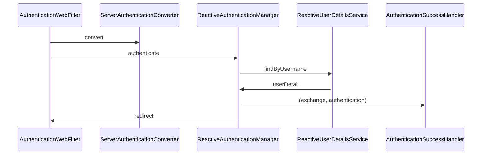

## Reactive Security Pre-Authentication Example

A Spring Security Reactive Pre-Authentication example. 

```mermaid
sequenceDiagram
    AuthenticationWebFilter->>ServerAuthenticationConverter: convert
    activate ServerAuthenticationConverter
    AuthenticationWebFilter->>ReactiveAuthenticationManager: authenticate
    activate ReactiveAuthenticationManager
    ReactiveAuthenticationManager->>ReactiveUserDetailsService: findByUsername
    activate ReactiveUserDetailsService
    ReactiveUserDetailsService->>ReactiveAuthenticationManager: userDetail
    activate ReactiveAuthenticationManager
    ReactiveAuthenticationManager->>AuthenticationSuccessHandler: (exchange, authentication)
    ReactiveAuthenticationManager->>AuthenticationWebFilter: redirect
```
